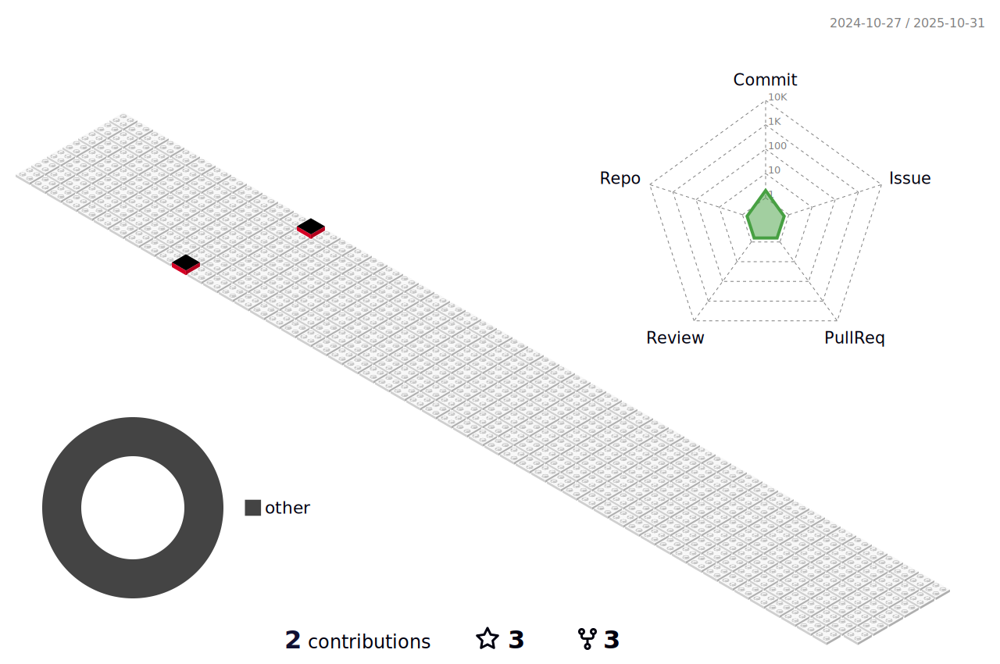

<!--
  
-->

#

### Hi there 👋

I'm Seung Yeop Oh
- 🌱 I’m currently working on Deep Learning(Vision, Time-Series)  
- 🔎 I'm also interested Generative-AI & Computer Vision 
- ✨ If you're curious about me, click <b>[here](https://seungyeopoh.github.io/CV/)</b>. 
- 💬 Ask me about anything <b>[here](https://github.com/SEUNGYEOPOH/SEUNGYEOPOH/issues)</b>. 

# 

 <a> 
   
  

 

 

</a> 
  #
  
<!---->

#
 
 #
  

   
 

#

  
 

#

#

<!---->

